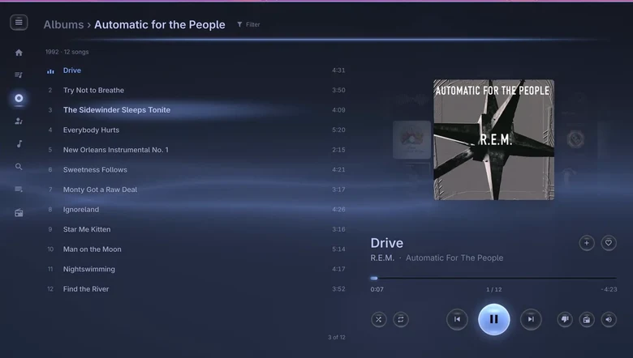
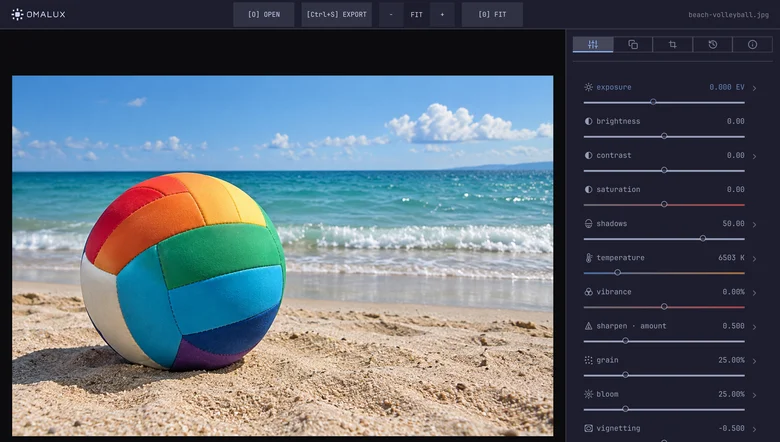
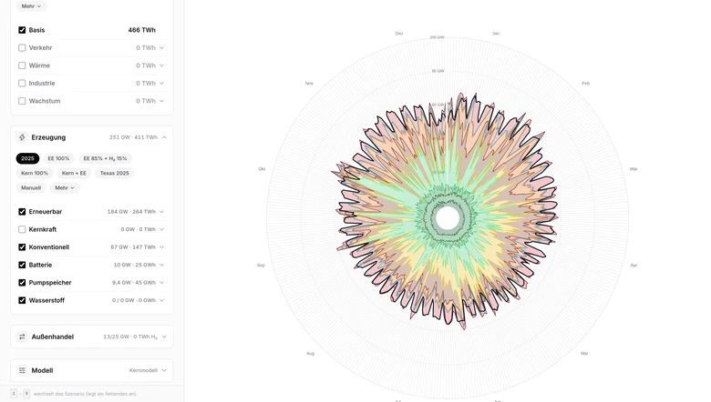
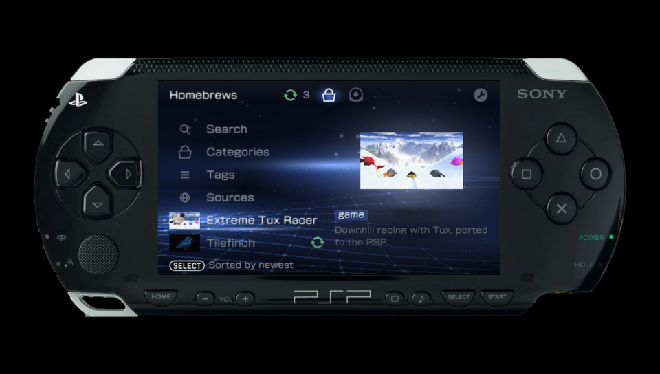
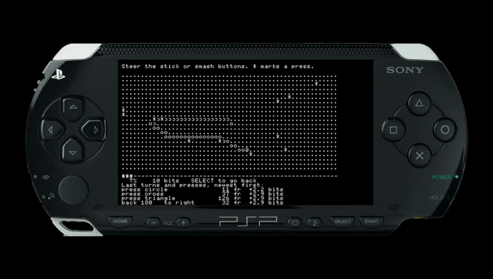
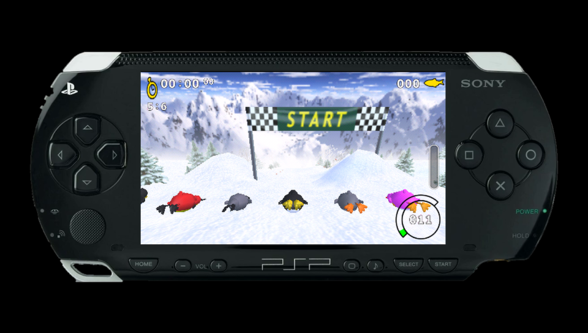

### hello

<table>
<tr>
<td align="center" valign="top"> <a href="https://github.com/chriopter/brumm"><b>brumm</b></a> Apple Music for Omarchy</td>
<td align="center" valign="top"> <a href="https://github.com/chriopter/omalux"><b>omalux</b></a> Photo processing for Omarchy</td>
<td align="center" valign="top"><a href="https://github.com/chriopter/netzprobe.de"><picture><source media="(prefers-color-scheme: dark)" srcset="img/netzprobe-dark.webp"></picture></a> <a href="https://github.com/chriopter/netzprobe.de"><b>netzprobe.de</b></a> Simulate the German grid</td>
</tr>
</table>

### PlayStation Portable

<table>
<tr>
<td align="center" valign="top"> <a href="https://github.com/chriopter/pspdx-app"><b>PSPDX App</b></a> Installs and updates homebrew via WiFi <a href="https://github.com/chriopter/pspdx">Standard</a> · <a href="https://github.com/chriopter/pspdx-catalog">Catalog</a></td>
<td align="center" valign="top"> <b>pspkit</b> Modules for PSP development <a href="https://github.com/chriopter/pspkit-sidecar">SIDECAR</a> · PSP as monitor <a href="https://github.com/chriopter/pspkit-https">HTTPS</a> · Modern TLS client <a href="https://github.com/chriopter/pspkit-autoboot">AUTOBOOT</a> · Remote reboot <a href="https://github.com/chriopter/pspkit-usbnet">USBNET</a> · Network over USB</td>
<td align="center" valign="top"> <a href="https://github.com/chriopter/psp-tuxracer"><b>Tux Racer</b></a> Port of Extreme Tux Racer</td>
</tr>
</table>

And more PSP: [Cathedral](https://github.com/chriopter/psp-cathedral) · [Graphics Demo](https://github.com/chriopter/psp-graphicsdemo) · [Rust Raytracer](https://github.com/chriopter/psp-rust-raytracer)
